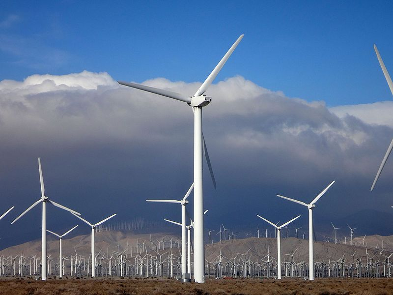
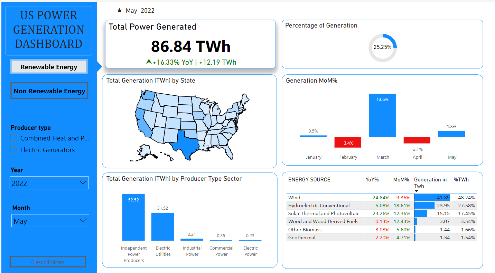
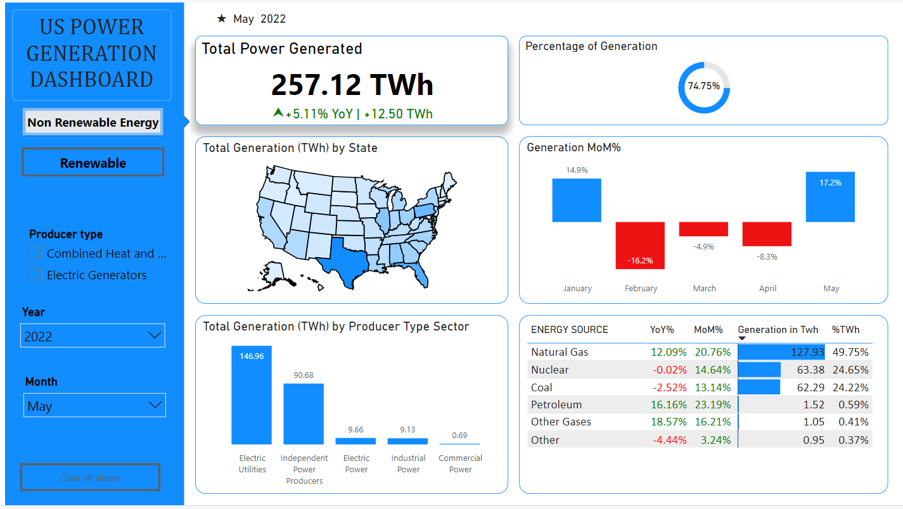

# US-Power-Generation-Analysis

  

## Introduction/Problem Statement
In the realm of U.S. energy generation, a critical challenge revolves around understanding the intricacies of renewable energy production. This involves deciphering annual trends, major producer contributions, and the influence of top states on national renewable energy goals. The lack of such comprehension hampers effective decision-making and policy formulation.

This analysis employs exploratory data analysis (EDA) on U.S. Energy Information Administration (EIA) data, focusing on renewable energy sources. The goal is to uncover insights into annual trends, major producer dynamics, and the impactful roles played by top states. A notable stride in this effort is the creation of a dynamic dashboard for real-time tracking of year-over-year growth.

Collectively, these endeavours aim to bridge the gap between complex data and informed decision-making. By providing actionable insights, the analysis seeks to empower decision-makers, industry stakeholders, and executives, guiding the nation toward a more sustainable, resilient, and strategically informed future in U.S. energy generation.

## Data Source 
The dataset was downloaded from Kaggle in CSV file format

## Data Cleaning/Exploration
The data cleaning and exploration were done using R [to go cleaning](https://github.com/protechanalysis/US-Power-Generation-Analysis/blob/main/eda_us_power.ipynb)

## Data Visualization

  
  

## Insight

- **Renewable Trend:** Ongoing upward trajectory in renewable energy generation signifies a national commitment to cleaner power sources.
  
- **Declining Non-Renewables:** Gradual decline in non-renewable energy generation mirrors a broader shift towards sustainability.

- **Top Renewable States:** Washington, California, and Texas lead in renewable power generation, showcasing regional dedication to clean energy initiatives.

- **Top Non-Renewable States:** Texas, Florida, and Pennsylvania emerge as major players in non-renewable power generation.

- **Major Renewable Sources:** Hydroelectric conventional and wind are key contributors to the sustainable energy mix.

- **Major Non-Renewable Sources:** Coal and natural gas remain primary generators in the non-renewable energy sector.

- **Power Producer Landscape:** Electric utilities and independent power producers play pivotal roles in shaping the U.S. energy trajectory, contributing significantly to the nation's evolving energy landscape.

## Recommendations
1. **Invest in Renewable Infrastructure:**
   - Allocate resources for the development and enhancement of renewable energy sources such as solar, wind, and hydroelectric projects.

2. **Policy Support and Incentives:**
   - Implement supportive policies and financial incentives to encourage the growth of clean energy, including tax credits and grants for renewable projects.

3. **Research and Development:**
   - Invest in research and development for emerging clean energy technologies to drive innovation, improve efficiency, and reduce production costs.

4. **Grid Modernization:**
   - Upgrade and modernize the electrical grid to accommodate a higher share of renewable energy, investing in smart grid technologies for improved efficiency.

5. **Community Engagement and Education:**
   - Increase public awareness and understanding of the benefits of clean energy through educational programs, fostering community support for renewable projects.
